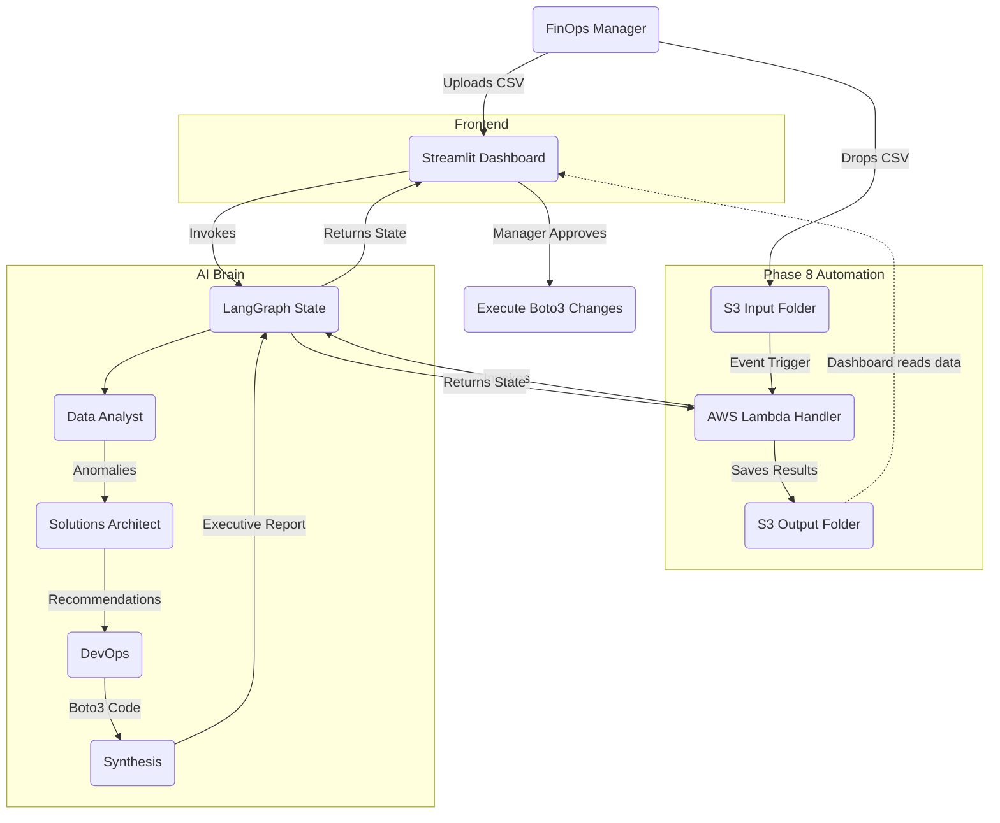

# Architectural Flowchart

This diagram illustrates both the Human-in-the-Loop flow (Streamlit) and the fully automated Event-Driven flow (S3 + Lambda).

```mermaid
graph TD
    User(FinOps Manager)
    
    subgraph Phase 8 Automation
        S3In(S3 Input Folder)
        Lambda(AWS Lambda Handler)
        S3Out(S3 Output Folder)
    end

    subgraph Frontend
        UI(Streamlit Dashboard)
    end

    subgraph AI Brain
        L(LangGraph State)
        A1(Data Analyst)
        A2(Solutions Architect)
        A3(DevOps)
        A4(Synthesis)
    end
    
    User -->|Uploads CSV| UI
    User -->|Drops CSV| S3In
    
    S3In -->|Event Trigger| Lambda
    Lambda -->|Invokes| L
    UI -->|Invokes| L
    
    L --> A1
    A1 -->|Anomalies| A2
    A2 -->|Recommendations| A3
    A3 -->|Boto3 Code| A4
    A4 -->|Executive Report| L
    
    L -->|Returns State| Lambda
    L -->|Returns State| UI
    
    Lambda -->|Saves Results| S3Out
    S3Out -.->|Dashboard reads data| UI
    
    UI -->|Manager Approves| Execute(Execute Boto3 Changes)
```